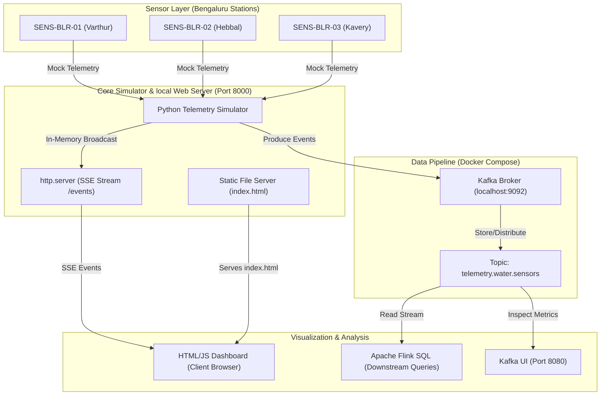

# HydroGuard System Architecture

The HydroGuard pipeline simulates real-time E. Coli and Turbidity telemetry from multiple Bengaluru-based water quality bio-sensors, routes the data through a local web streaming engine for visual monitoring, and publishes it to a Kafka broker for downstream analytical processing via Flink SQL.

---

## 1. Visual System Architecture

Below is the visual overview of the HydroGuard ingestion, streaming, and analytics pipeline:

---

## 2. Interactive Pipeline Diagram

This flow diagram illustrates how data flows from the physical sensor stations through the Python Simulator, splitting into the local SSE dashboard stream and the Kafka broker stream:

---

## 3. Core Architecture Layers

### A. Ingestion / Simulation Layer
*   **Component**: [simulator.py](simulator.py)
*   **Role**: Generates simulated water quality telemetry for three bio-sensor stations.
*   **Data Characteristics**: Generates random anomaly events (15% probability) featuring spiked Turbidity levels and high E. Coli enzyme fluorescence to simulate contamination. 

### B. Streaming / Kafka Layer
*   **Components**: Confluent cp-kafka Broker & Provectus Kafka UI (Docker Compose)
*   **Role**: Provides a scalable, persistent log of telemetry events.
*   **Topic**: `telemetry.water.sensors` (Configured with partition count of 3 and replication factor of 1 for local development).
*   **Monitoring**: Kafka UI hosts a dashboard on port `8080` to track topic health and message logs.

### C. Web / Visualization Layer
*   **Components**: [index.html](index.html) & Embedded Python HTTP Web Server
*   **Role**: Delivers immediate real-time monitoring to browser clients.
*   **Mechanism**: The simulator hosts a multi-threaded web server on port `8000`. When a client loads the page, it opens a persistent **Server-Sent Events (SSE)** connection to `/events`. New telemetry data points are pushed dynamically to the client browser and charted live via **Chart.js**.

### D. Analytics Layer
*   **Component**: [flink_query.sql](flink_query.sql)
*   **Role**: Formulates downstream analysis rules.
*   **Logic**: Runs tumbling windows (5-minute intervals) using Flink SQL over the Kafka stream, triggering alerts if E. Coli average exceeds `1.0 MPN` and Turbidity average exceeds `5.0 NTU` within the window.

---

## 4. Default Port Mapping

| Service | Protocol | Host Port | Container Port | Purpose |
| :--- | :--- | :--- | :--- | :--- |
| **Water Quality Dashboard** | HTTP/SSE | `8000` | `8000` | Visual real-time sensor metrics |
| **Kafka Broker** | TCP | `9092` | `9092` | Event ingestion endpoint |
| **Kafka UI** | HTTP | `8080` | `8080` | Topic and message inspection |
