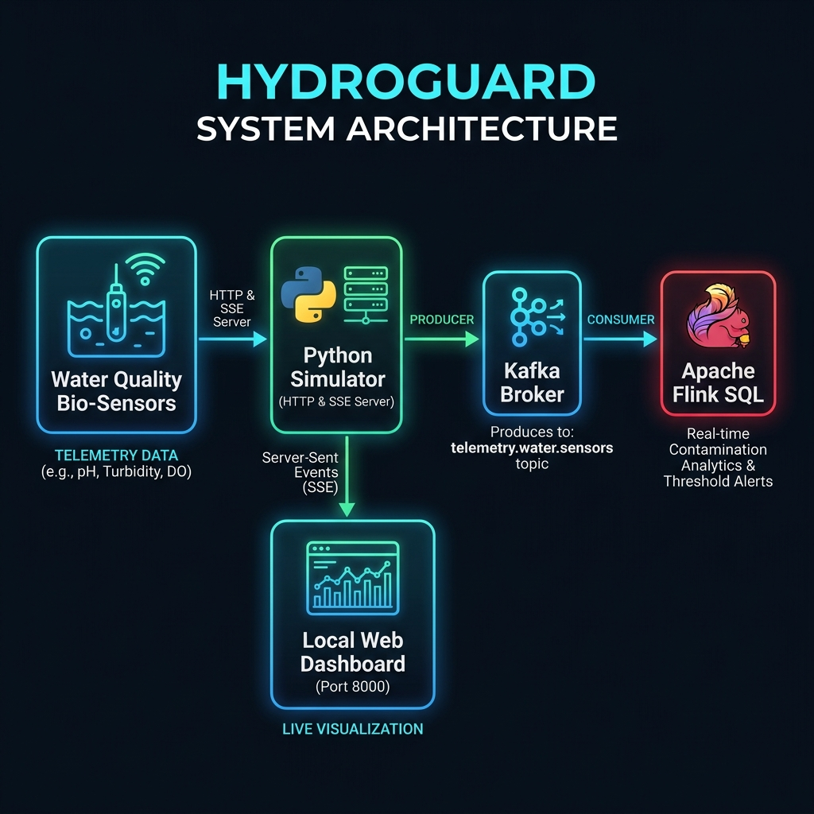

# HydroGuard Kafka Simulator

Publishes simulated water sensor telemetry to a Kafka topic for downstream Flink SQL processing, and hosts a real-time web monitoring dashboard.

## System Architecture

Below is the real-time data ingestion, streaming, and analytics architecture of HydroGuard:



## Application Use Case

Bengaluru's municipal water systems monitor key reservoirs and treatment intakes to ensure public water safety. Hand-sampling is slow, while raw sensor streams can be noisy. HydroGuard provides a complete, modern end-to-end telemetry system:

1.  **Simulation & Ingestion**: Water quality bio-sensors continuously measure Turbidity (suspended solids) and fluorescence to estimate *E. coli* bacteria counts (MPN/100mL).
2.  **Immediate Monitoring (Local Control Room)**: A light-weight local web dashboard streams data directly from the sensors using **Server-Sent Events (SSE)**, alerting operator panels instantly (Red/Green indicators) when thresholds are breached.
3.  **Scalable Data Bus**: Ingests high-frequency sensor readings into a **Kafka** topic (`telemetry.water.sensors`), allowing multiple downstream microservices to consume the feed reliably.
4.  **Temporal Analytics (Apache Flink)**: Downstream Flink SQL groups telemetry into **5-minute tumbling windows**. By checking 5-minute averages, Flink filters out short-lived sensor noise (such as a temporary leaf blocking a lens) and only triggers a **`CRITICAL_CONTAMINATION`** alarm when contamination is sustained.

## Configure

Copy `.env.example` to `.env` and fill in your Kafka cluster values:

```powershell
Copy-Item .env.example .env
```

Required for a real cluster:

- `KAFKA_BOOTSTRAP_SERVERS`
- `KAFKA_TOPIC`
- `KAFKA_API_KEY`
- `KAFKA_API_SECRET`

For a local plaintext Kafka cluster, set only:

```powershell
$env:KAFKA_BOOTSTRAP_SERVERS = "localhost:9092"
$env:KAFKA_SECURITY_PROTOCOL = "PLAINTEXT"
```

## Run Locally

```powershell
.\venv\Scripts\python.exe simulator.py
```

If `KAFKA_BOOTSTRAP_SERVERS` is not set, the simulator runs in dry-run mode and prints payload summaries only.

When running, the real-time **HydroGuard Web Dashboard** is automatically hosted at [http://localhost:8000](http://localhost:8000).

## Deploy with Docker Compose (Recommended)

To deploy a local Kafka cluster, the Kafka UI dashboard, the HTML dashboard, and the simulator all at once, run:

```powershell
docker compose up --build -d
```

Once started:
- The **Water Quality Web Dashboard** is available at [http://localhost:8000](http://localhost:8000) to visualize real-time contamination levels, trends, and sensor status.
- The **Kafka Broker** is running locally and accessible on `localhost:9092`.
- The **Kafka UI** web dashboard is available at [http://localhost:8080](http://localhost:8080) to inspect topics, view active sensor events, and analyze message throughput.
- The **Simulator** runs in the background, automatically waiting for the broker to start before creating the `telemetry.water.sensors` topic and publishing live water sensor telemetry.

To stop the services and remove containers:

```powershell
docker compose down
```

## Run With Docker (Single Container)

If you have an existing Kafka cluster, you can run only the simulator container:

```powershell
docker build -t hydroguard-simulator .
docker run --env-file .env --rm hydroguard-simulator
```

## Kafka Topic

The producer writes JSON events to `telemetry.water.sensors` by default. To let the app create the topic, set:

```powershell
$env:KAFKA_CREATE_TOPIC = "true"
```

Your Kafka principal must have topic create permissions. Managed Kafka services often require creating topics from their console or CLI instead.

## Flink SQL

Before running `flink_query.sql`, replace these placeholders with your cluster values:

- `KAFKA_BOOTSTRAP_SERVERS`
- `KAFKA_API_KEY`
- `KAFKA_API_SECRET`

For a plaintext local Kafka cluster, remove the SASL properties from the table `WITH` clause and keep only `properties.bootstrap.servers`.
